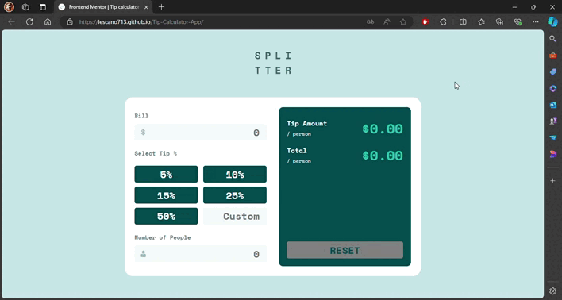

# Frontend Mentor - Tip calculator app solution

<div align="left">
  <a href="https://www.linkedin.com/in/danae-lescano-salvatierra" target="_blank">
    
  </a>
  <a href="https://lescano713.github.io/Tip-Calculator-App/" target="_blank">
    
  </a>
  <a href="https://www.frontendmentor.io/profile/Lescano713" target="_blank">
    
  </a>
</div>


## Table of contents

- [Overview](#overview)
  - [The challenge](#the-challenge)
  - [Screenshot](#screenshot)
- [My process](#my-process)
  - [Built with](#built-with)
  - [What I learned](#what-i-learned)
  - [Continued development](#continued-development)


## Overview

### The challenge

Users should be able to:

- View the optimal layout for the app depending on their device's screen size
- See hover states for all interactive elements on the page
- Calculate the correct tip and total cost of the bill per person

### Screenshot




## My process

### Built with

- Semantic HTML5 markup
- CSS custom properties
- Flexbox
- CSS Grid
- Mobile-first workflow


### What I learned

<p>I learned how to use media queries along with the properties <b>grid-template-columns</b> and <b>flex-wrap</b> to ensure that the buttons occupy the same width and wrap to the next line if there is not enough space. Additionally, I used <b>!important</b> to override other CSS properties.</p>


```css
  .active{
    background-color: var(--PrimaryStrongcyan)!important;
  }
  .available{
      background-color: var(--PrimaryStrongcyan)!important;
      cursor: pointer !important;
      &:hover{
          background-color: var(--buttonHover)!important;
      }
  }
```

<p>To keep the code readable and maintainable while reducing repetition, I implemented different functions for later reuse.</p>

```js
//function total tip
function calculateTip(percent,bill){
    return ((percent/ 100) * bill)
}
//function to calculate tip per person
function tipPerPerson(discount,people){
  //code
}

//function to calculate the total amount per person
function totalPerPerson(tip,bill,people){
  //code
}

//function to show the total
function showTotal(id, value){
  //code
}
```
<p>To ensure the data is correct, I used validations to check for numbers, ensuring they are not less than 0 and not NaN.</p>


```js
function queryInput(id){
    const input = parseFloat(document.querySelector(`#${id}`).value);
    return isNaN(input) ? 0 : input;
}

if(people <= 0){
        showTotal("tip-amount", 0);
        showTotal("total-amount", 0);
        sectionPeople.classList.add('error');
    }else if(bill < 0){
        sectionBill.classList.add('error');
        sectionPeople.classList.remove('error');
    }
```


### Continued development

<p>- <strong>JavaScript Best Practices</strong>: Improving JavaScript code readability and performance by refactoring and leveraging ES6 features like template literals and destructuring.</p>
<p>- <strong>Integrating APIs</strong>: Fetching and displaying data from external APIs to create more dynamic and interactive web applications.</p>
<p>These areas will help me build more sophisticated, user-friendly, and performant web applications.</p>